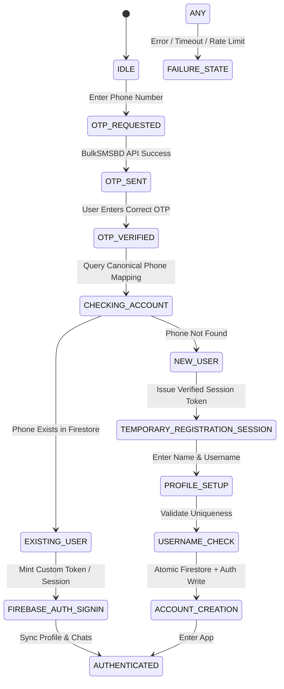

# Authentication Architecture

## 1. Core Authentication Components

BitChat implements a custom hybrid authentication architecture that uses **BulkSMSBD** for SMS OTP delivery while leveraging **Firebase Authentication** and **Firestore** for secure session management.

### State Machine & Transitions

---

## 2. Detailed Authentication States

- **IDLE**: User is on the phone input screen.
- **OTP_REQUESTED**: Client sends normalized phone number to secure backend proxy.
- **OTP_SENT**: Backend generates 6-digit OTP, stores temporary hash in Redis/Firestore with a 3-minute TTL, and calls BulkSMSBD.
- **OTP_VERIFIED**: User submits 6-digit code. Backend verifies hash and returns a short-lived temporary registration session JWT (for new users) or authenticates directly (for existing users).
- **ACCOUNT_CREATED**: Permanent Firebase Auth UID minted, Firestore user profile created, username index claimed atomically.
- **AUTHENTICATED**: Active user session established with valid refresh tokens and FCM bindings.
