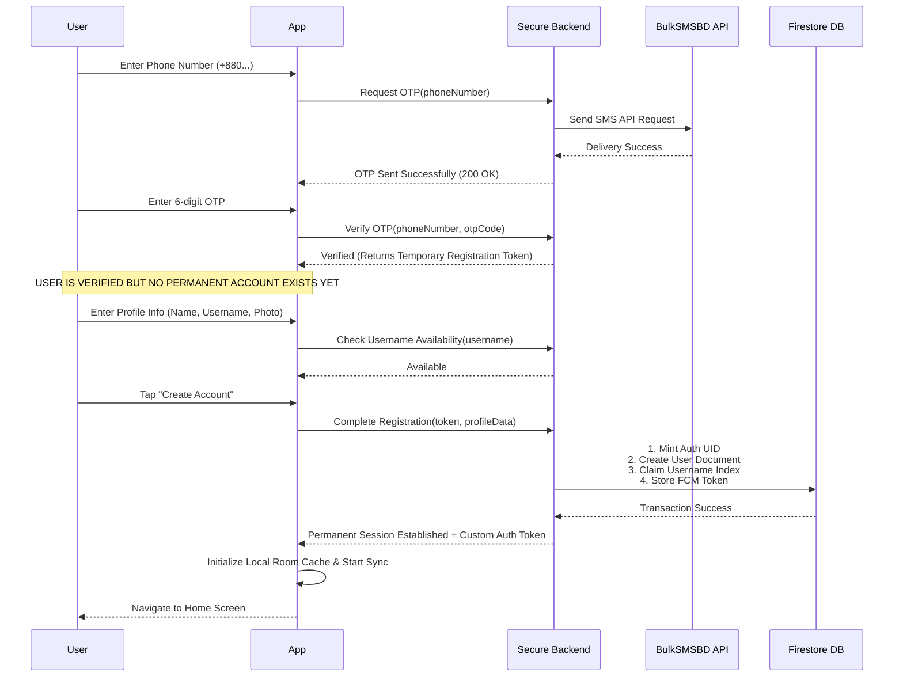

# User Registration Flow

## 1. Step-by-Step Registration Lifecycle

## 2. Abort / Abandonment Policy
- If the user closes the app or abandons registration after OTP verification:
  - **No Firestore User document** is created.
  - **No Firebase Auth UID** is created.
  - The temporary registration token expires automatically after 15 minutes.
  - Re-opening the app requires restarting verification from phone entry.
