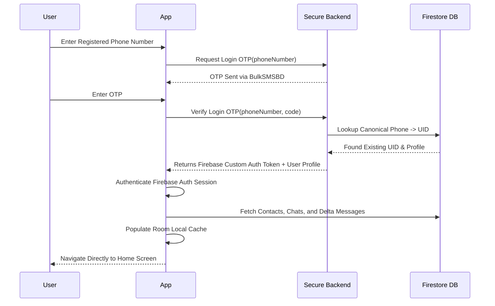

# Login Flow

## 1. Existing User Sign-In Process

## 2. Edge Case: Unregistered Number Attempting Login
- If the phone number lookup yields no existing user record during a login attempt:
  - The backend returns a specific status code (`ACCOUNT_NOT_FOUND`).
  - The app displays: **"Account not found. Create a new account."**
  - The user is smoothly redirected to the registration flow without creating ghost records.
