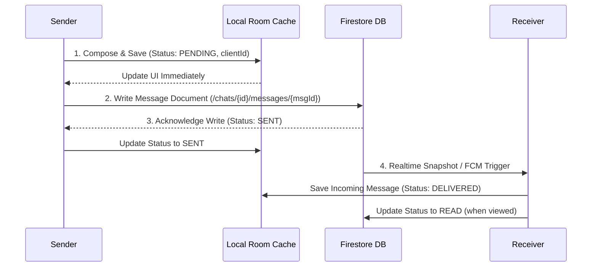

# Messaging Pipeline

## 1. Message Lifecycle

- **Retry Policy**: Exponential backoff retry mechanism for failed pending messages stored in Room.
- **Duplicate Prevention**: Client-generated `clientId` acts as an idempotent key.
